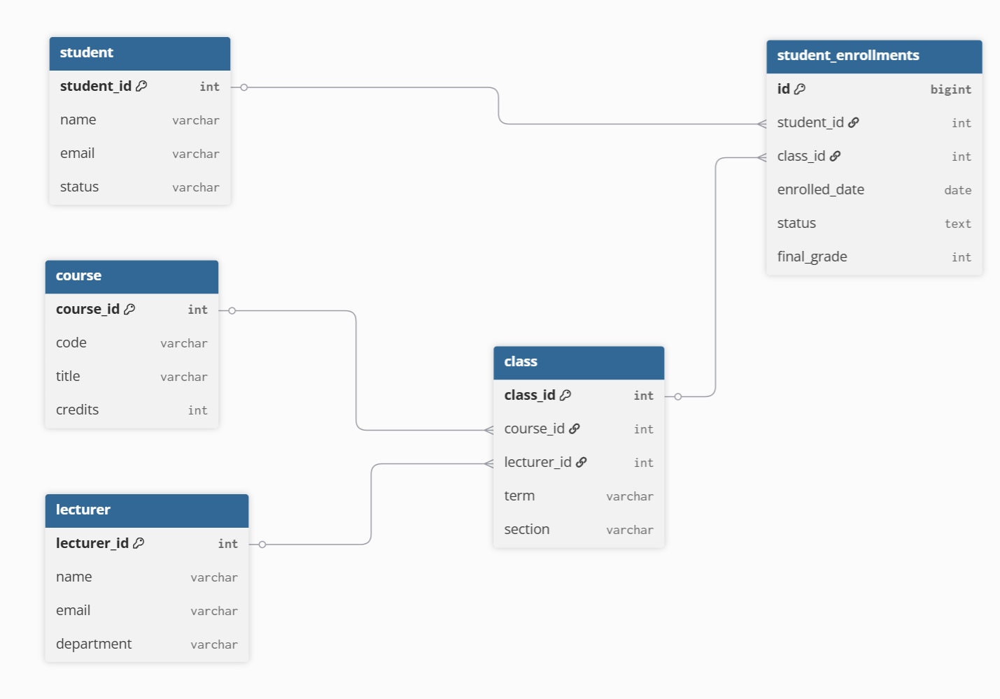

# Database for Yoobee College

Developing a small information system for Yoobee College. 
The database will store students, lecturers, the courses offered, and student enrollments.

# Main entities 

1. student - studying at Yoobee College: Key attributes: student_id (PK), name (VARCHAR), email (VARCHAR), status (VARCHAR)
- Key attributes: `student_id` (PK), `name` (VARCHAR), `contact_number` (VARCHAR),`email` (VARCHAR), `status` (VARCHAR)

2. lecturer -  who teaches the class 
- Key attributes: `lecturer_id` (PK), `name` (VARCHAR), `contact_number` (VARCHAR), `email` (VARCHAR), `department` (VARCHAR)

3. course - Catalog entry defining the curriculum and instructional scope of a subject.  
- Key attributes: `course_id` (PK), `course_code` ("MSE800") (VARCHAR), `name` (VARCHAR), `credits` (INTEGER)

4. class - Scheduled offering of a course within a specific term
- Key attributes: `class_id` (PK), `course_id` (FK → Course), `lecturer_id` (FK → Lecturer), `term` ("2025-S2"), `section` (A or B) TEXT
- Business rules: (course_id, term, stream) should be UNIQUE

5. student_enrollments - A record linking a student to a class offering, including participation and final outcome.
- Key attributes: `student_enrollments_id` (PK), `student_id` (FK → Student), `class_id` (FK → class), `enrolled_date` (TEXT), `status` (TEXT), `grade` (INT)

#Database Schema Diagram

