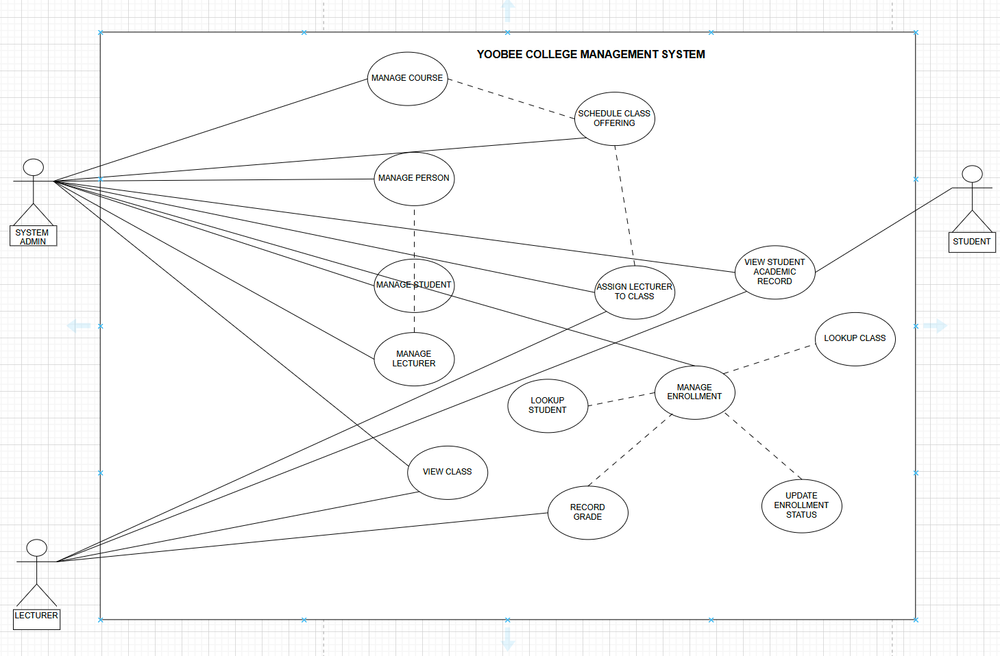
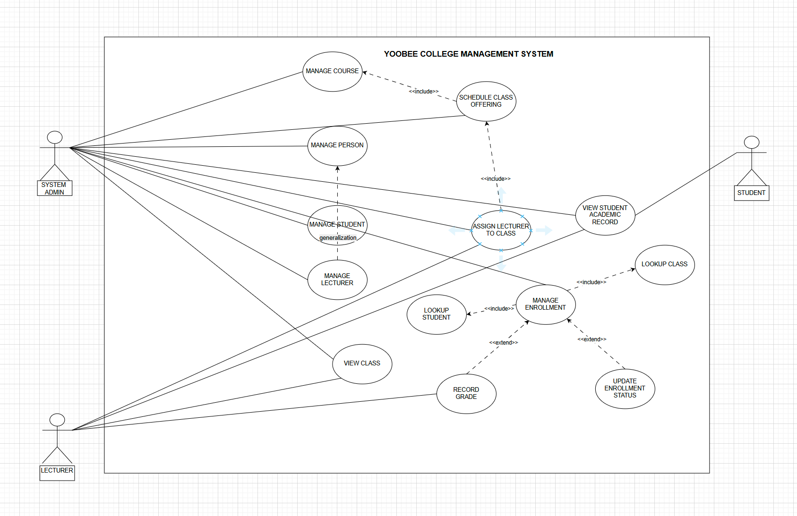
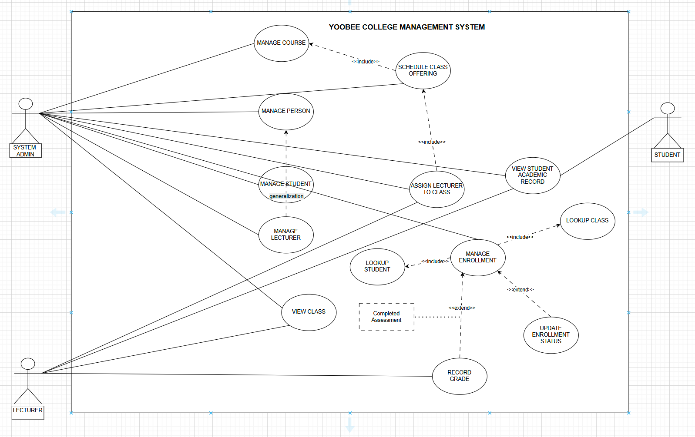

#  Yoobee College Management System
Developing a small information system for Yoobee College. The database will store students, lecturers, the courses offered, and student enrollments.

The system will records:

Student enrollment – Identifies which student is registered in which class
Lecturers assignment – Specifies which lecturers teaches each class
Academic outcome – Records the student’s final result in the class

# STEP 1

### ACTORS
1. Students
2. Lecturers
3. System Admin/Users

## USE CASES
1. Manage Course ⟶ «include» from Schedule Class Offering
2. Schedule Class Offering ⟶ «include» to Assign Lecturer to Class
3. Assign Lecturer to Class
4. Manage Person ▸▸ generalizes to Manage Student and Manage Lecturer
5. Manage Student  
6. Manage Lecturer
7. Manage Enrollment ⟶ «include» Lookup Student, «include» Lookup Class
8. Lookup Student
9. Lookup Class
10. Record Grade «extend» Manage Enrollment
11. Update Enrollment Status «extend» Manage Enrollment
12  Manage Enrollment
13. View Class (Registrar, Lecturer)
14. View Student Academic Record (Student, Registrar)

# STEP 2

- This use case diagram illustrates the interactions between various actors and the system. Each actor represents a distinct role that interacts with the system to achieve specific goals. The diagram maps out the functionalities (use cases) the system provides and shows which actors are associated with each use case.

# STEP 3
- The use case diagram below represents the Yoobee College Management System. It shows how the actors—Student, Lecturer, and Admin—interact with the system and what each can accomplish. The diagram also highlights the relationships between use cases, including generalization to represent commmon behaviours between actors or use cases.

It also illustrates dependencies between use cases, where << include >> show the required functionality and << extend >> represents as optional. 
 

# WITH CONDITION

## USE CASES ##                                               BRIEF USE CASE  DESCRIPTION
1. Manage Course                                            - User/Actors can manage Courses by adding, viewing, updating and deleting course records with course codes, names, and credits
2. Schedule Class Offering                                  - System Admin/Registrar creates class schedules by linking courses with specific terms, sections, and time slots for student enrollment
3. Assign Lecturer to Class                                 - System Admin/Registrar assigns qualified lecturers to scheduled classes while preventing scheduling conflicts and ensuring proper coverage
4. Manage Person                                            - Abstract use case that provides common person management functionality (name, contact, email) inherited by student and lecturer management
5. Manage Student                                           - Academic Staff manages student records including personal information, contact details, academic status, and enrollment history through CRUD operations
6. Manage Lecturer                                          - System Admin/Academic Staff manages lecturer profiles including personal information, department assignments, contact details, and teaching qualifications
7. Manage Enrollment                                        - Academic Staff processes student enrollments by registering students for classes, tracking enrollment dates, and maintaining enrollment status
8. Lookup Student                                           - System users search and retrieve specific student information using various criteria such as name, ID, or contact information for quick access
9. Lookup Class                                             - System users search for class information including course details, lecturer assignments, schedules, and available sections
10. Record Grade                                            - Lecturers and Academic Staff enter and update student grades (0-100 scale) for completed coursework and final assessments
11. Update Enrollment Status                                - Academic Staff modifies student enrollment status (Enrolled, Completed, Withdrawn, Failed) based on academic progress and circumstances
12. Manage Enrollment                                       - Comprehensive enrollment management including adding, viewing, updating, and removing student class registrations
13. View Class (Registrar, Lecturer)                       - Registrar and Lecturers access class information including enrolled students, class schedules, course details, and section information
14. View Student Academic Record (Student, Registrar)      - Students and Registrar access comprehensive academic records including enrollment history, grades, course completions, and academic standing