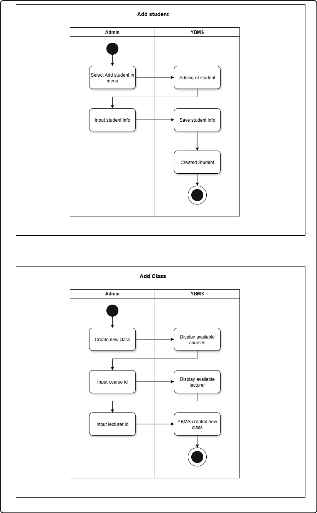

#  Yoobee College Management System
Developing a small information system for Yoobee College. The database will store students, lecturers, the courses offered, and student enrollments.

The system will records:

1. Student enrollment – Identifies which student is registered in which class
2. Lecturers assignment – Specifies which lecturers teaches each class
3. Academic outcome – Records the student’s final result in the class

# Week 4- Activity 2: Activity diagram

### Activity Diagram

