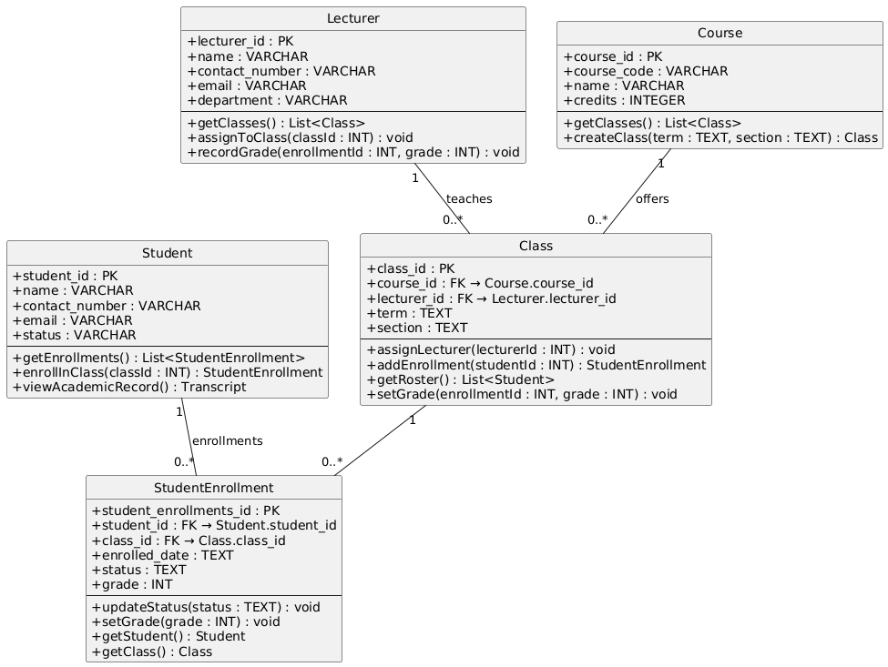

#  Yoobee College Management System
Developing a small information system for Yoobee College. The database will store students, lecturers, the courses offered, and student enrollments.

The system will records:

1. Student enrollment – Identifies which student is registered in which class
2. Lecturers assignment – Specifies which lecturers teaches each class
3. Academic outcome – Records the student’s final result in the class

# Week 4- Activity 3: Class diagram

1. Student "1" -- "0..*" StudentEnrollment : enrollments
 - One Student can have zero or many StudentEnrollment records (their “enrollments”).
 - Each StudentEnrollment must link to exactly one Student.

2. Class "1" -- "0..*" StudentEnrollment
 - One Class can have zero or many enrollments.
 - Each StudentEnrollment belongs to exactly one Class.

3. Lecturer "1" -- "0..*" Class : teaches
 - One Lecturer teaches zero or many Classes.
 - Each Class has exactly one Lecturer.

4. Course "1" -- "0..*" Class : offers
 - One Course is offered as zero or many Class instances (e.g., sections/terms).

### Class Diagram

