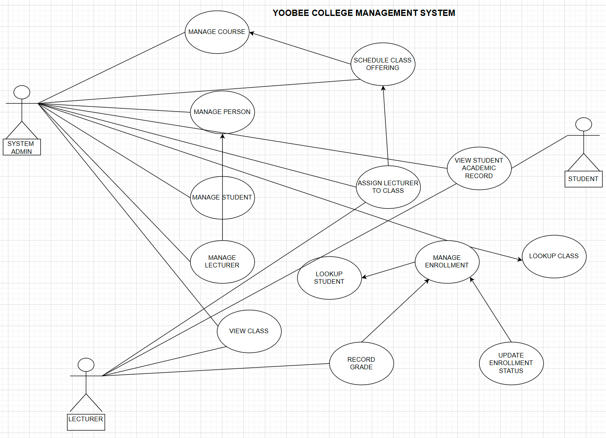
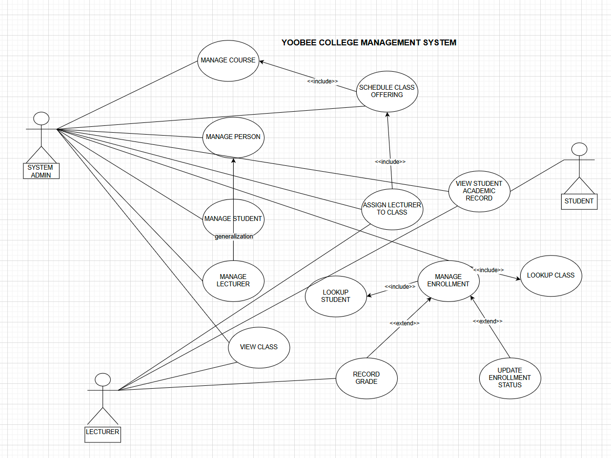

#  Yoobee College Management System
Developing a small information system for Yoobee College. The database will store students, lecturers, the courses offered, and student enrollments.

The system will records:

Student enrollment – Identifies which student is registered in which class
Lecturers assignment – Specifies which lecturers teaches each class
Academic outcome – Records the student’s final result in the class

# STEP 1

### ACTORS
1. Students
2. Lecturers
3. System Admin/Users

## USE CASES
1. Manage Course ⟶ «include» from Schedule Class Offering
2. Schedule Class Offering ⟶ «include» to Assign Lecturer to Class
3. Manage Person ▸▸ generalizes to Manage Student and Manage Lecturer
4. Manage Enrollment ⟶ «include» Lookup Student, «include» Lookup Class
5. Record Grade «extend» Manage Enrollment
6. Update Enrollment Status «extend» Manage Enrollment
7. View Class (Registrar, Lecturer)
8. View Student Academic Record (Student, Registrar)

# STEP 2

- This use case diagram illustrates the interactions between various actors and the system. Each actor represents a distinct role that interacts with the system to achieve specific goals. The diagram maps out the functionalities (use cases) the system provides and shows which actors are associated with each use case.

# STEP 3
- The use case diagram below represents the Yoobee College Management System. It shows how the actors—Student, Lecturer, and Admin—interact with the system and what each can accomplish. The diagram also highlights the relationships between use cases, including generalization to represent commmon behaviours between actors or use cases.

It also illustrates dependencies between use cases, where << include >> show the required functionality and << extend >> represents as optional. 
 
