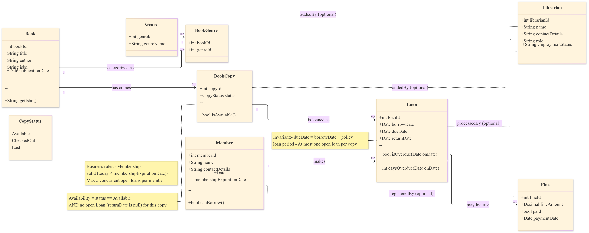
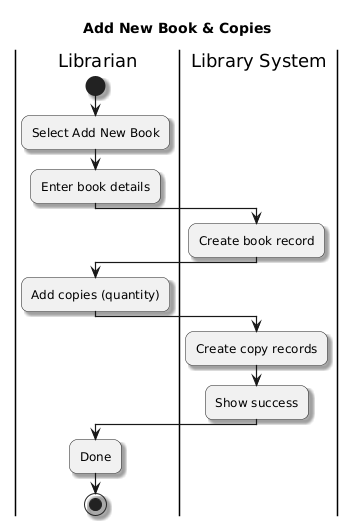

#  Library Management System

### Class Diagram

1. Book: Bibliographic record (title, author, ISBN, publicationDate). One Book can have many physical copies.
2. Genre: Lookup table of genres.
3. BookGenre: Junction entity implementing many-to-many between Book and Genre.
4. BookCopy: A physical, lendable copy. Has a status (Available, CheckedOut, Lost).
5. Member: Library patron with contact details and membershipExpirationDate.
6. Librarian: Staff / admin user. Used optionally to record who performed actions (provenance).
7. Loan: Circulation record linking a Member to a BookCopy with borrowDate, dueDate, and returnDate.
8. Fine: Overdue charge attached to a Loan; includes amount, paid flag, and paymentDate.

### Use-Case Diagram

### Actors
1. Member: A library patron who searches the catalog, borrows/returns books, views loans, and pays fines.
2. Librarian: Staff who can also register members and add books/copies, in addition to borrowing/returning on behalf of patrons.

### Key Use Cases
1. Search Catalog: Find books by title/author/ISBN and filter by genre.
2. Borrow Book: Create a loan for an available copy after eligibility checks.
3. Return Book: Close a loan and restore copy availability; compute overdue fine if late.
4. View My Loans: Show a member’s current loans with due dates.
5. Pay Fine: Settle overdue fines (after late returns).
6. Add New Book & Copies: Create a new book record and physical copies (admin).
7. Register Member: Add a new library member with an expiry date (admin).
### Sub Use Cases (Reusable Checks)
1. Calculate Fine: Compute overdue days × daily rate during returns.
2. Check Eligibility: Composite check ensuring membership valid, loan limit not exceeded, and copy available.
3. Check Membership Valid: Membership not expired as of today.
4. Check Loan Limit (≤5): Member has no more than 5 concurrent open loans.
5. Check Copy Availability: A physical copy exists that is not already on loan.

### Sequence Diagram

### A) Check Availability
1. Goal: See if a free physical copy exists for the chosen book.
2. Trigger: Member clicks 'Borrow this book'.
3. System: Finds the book by ISBN/title, then looks for an available copy.
4. Outcome: If a copy is found → continue to eligibility checks. If none → show 'No copies available. Place a hold / join the waitlist.'

### B1) Membership Valid?
1. Goal: Ensure the library card is still valid.
2. System: Compares membershipExpirationDate with today.
3. Outcome: Valid → continue. Expired → stop and show 'Membership expired—please renew.'

### B2) Loan Limit (≤ 5)?
1. Goal: Enforce the policy of maximum 5 active loans.
2. System: Counts the member’s open loans.
3. Outcome: ≤5 → continue. >5 → stop and show 'You already have 5+ books out—return some first.'

### B3) Unpaid Fines?
1. Goal: Block borrowing if old fines are unpaid.
2. System: Checks total outstanding fines.
3. Outcome: 0 → continue. >0 → stop and show 'Borrowing blocked until fines are paid.'

### C) Create Loan
1. Goal: Finalize the borrow after all checks pass.
2. System: Creates the Loan (borrowDate and dueDate) and marks the copy OnLoan.
3. Member sees: 'Success—your loan is active. Due on {dueDate}.'

### D) Borrow — Failure Reasons
1. Goal: Explain clearly why borrowing was stopped and what to do next.
2. Possible messages: 'No copies available—place a hold', 'Membership expired—renew to borrow', 'Limit reached (5)—return some books first', 'Unpaid fines—pay to continue'.

### E) Find Open Loan (for Return)
1. Goal: Make sure the system is returning the correct active loan for that copy.
2. System: Looks up the open loan by copyId.
3. Outcome: Found → continue with return. Not found → show 'No active loan for this copy—please see the desk.'

### F) Fine Calculation
1. Goal: Work out late days and the fine amount.
2. System: Compares dueDate with today to compute days overdue and fine.
3. Outcome: Fine = 0 → 'Returned on time.' Fine > 0 → 'Overdue {days} day(s). Fine: {amount}.' (Member can pay now or later.)

### G) Close Loan & Update Copy
1. Goal: Finish the return and update availability.
2. System: Sets returnDate on the loan and marks the copy Available.
3. Member sees: No fine → 'Returned on time—thank you.' Fine due → 'Returned—You owe {amount} for {days} day(s).'

### Activity Diagram

### Borrow Book
• Member chooses a book. System checks membership, available copy, loan limit and fines. If OK, member confirms and the system creates the loan, marks the copy on-loan, and shows the due date.
	

### Return Book
• Member brings the copy. System scans and finds the open loan. If overdue, it calculates the fine. Member pays if needed; system records the return and sets the copy to Available.

### Add New Book & Copies (Admin)
• Librarian enters a new title and quantity of copies. The system creates the book and copy records and confirms.

### Register Member (ADmin)

• Librarian inputs details. System creates the member, sets expiry, and provides a card for the librarian to hand over.

### Pay Fine
• Member reviews outstanding fines, selects a payment method, pays and gets a receipt. Status becomes Paid.
